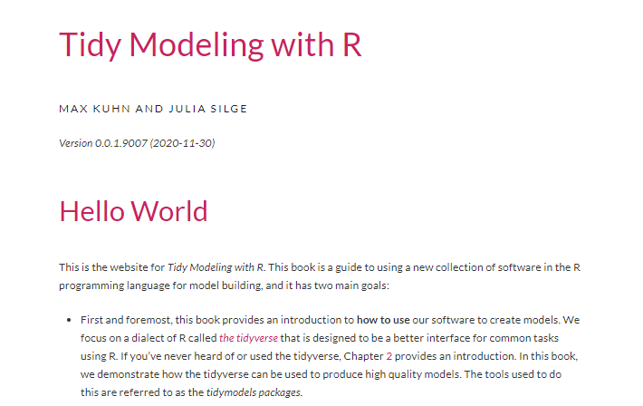

<center>

</center>

```{r, include=FALSE}
knitr::opts_chunk$set(echo = TRUE,
                      warning = FALSE,
                      message = FALSE,
                      fig.align = "center")
```

- [Sitio oficial del reto en DataSource.](https://www.datasource.ai/es/home/data-science-competitions-for-startups/prediciendo-el-rating-de-las-aplicaciones-en-google-play-store)

# Metodología

- Las siguientes imágenes fueron tomadas del libro [Tidy Modeling with R](https://xgboost.readthedocs.io/en/latest/parameter.html) de [Max Kuhn](https://github.com/topepo) y [Julia Silge.](https://github.com/juliasilge)

## Marco General

<center>

</center>

## Estrategia de Validación

- La siguiente imagen fue tomada de [tidymodels.org](https://www.tidymodels.org/start/case-study/) e ilustra la estrategia de evaluación de modelos que adopté.

<center>

</center>

## Fases del Modelado

<center>

</center>

## Libros

### *Tidy Modeling with R*

- Consultar libro [aquí](https://www.tmwr.org/)

<center>

</center>

### *Applied Predictive Modeling*

- Consultar el libro [aquí.](http://appliedpredictivemodeling.com/)

<center>

</center>

### *Feature Engineering and Selection A Practical Approach for Predictive Models*

- Consultar libro [aquí.](http://www.feat.engineering/)

<center>

</center>


# Variables

<center>

</center>

# Notas

- Con la modelación realizada hasta ahora queda claro que la mejor métrica a optimizar es **`f_meas`** (F1 Score) desde tiymodels.
- Después de probar varios modelos en la primera etapa, los candidatos finales son:
  - Red neuronal (perceptrón multicapa) con keras.
  - LightGBM con treesnip
  - Catboost con treesnip
  - Support Vector Machine con kernel radial
  - XGBoost
  - **Línea base:** para conocer si la ingeniería de caracterísiticas funciona, utilizo como línea base el modelo lineal generalizo (regresión logística) regularizado.
  - En esta segunda fase de modelación voy a añadir modelos entrenados con H2o desde R.

# Datos

```{r, warning=FALSE, message=FALSE}
# Cargando datos
library(tidyverse)
load("../data/train_FE1.Rdata")
load("../data/test_FE1.Rdata")
sampleSub <- read_csv("../data/sample_submission.csv")
head(new_train1)
```

- Selecciono sólo las variables que van a ingresar al análisis.

```{r}
mi_train <- new_train1 %>% 
  select(-c(App, date_update))

mi_test <- new_test1 %>% 
  select(-c(App, date_update))
```

- Primero se garantiza que los modelos sean entrenados con las mismas variables que contiene el archivo de test (submission).

```{r}
library(fastDummies)
# Binarización en test
binar_train <- dummy_cols(mi_train, remove_selected_columns = TRUE)
binar_test <- dummy_cols(mi_test, remove_selected_columns = TRUE)

# Las mismas variables en train y test (submission)
variables_iguales <- c(names(binar_train)[names(binar_train) %in% names(binar_test)],
                       "Rating")

# Datos de train finales
binar_train <- binar_train[, variables_iguales]
```

# Modelo GLM Regularizado

- Preprocesamiento:
  - Imputación a través de *knn* (2 vecinos).
  - Binarización.  
  - Transformación Yeo-Johnson
  - Escalado y normalización.
  - Como es un problema de clasificación imbalanceado, utilizo la biblioteca [themis](https://github.com/tidymodels/themis) para generar clases balanceadas a través de muestreo con reemplazo (ascendnete - *upsample*).
- Pasos a seguir con *tidymodels*:
  - 0. División en *train*, *validación* y *test*
  - 1. Definir preprocesamiento
  - 2. Definir el modelo y los hiperparámetros a optimizar
  - 3. Definir la estrategia de validación del modelo
  - 4. Definir tipo de *tuning* (grid de hiperparámetros)
  - 5. Definir el frujo de trabajo (*workflow* en *tidymodels*)
  - 6. Ejecución o entrenamiento de modelos (*tuning*)
  - 7. Evaluación de modelos (gráficos con métricas de error)
  - 8. Ajuste del modelo final
  - 9. Predicciones finales
   
# Etapas del modelo

## Etapa 0 - Split

```{r}
# Preprocesamiento
library(themis)
library(tidymodels)

# Train-Test
set.seed(2020)
data_split <- initial_split(data = binar_train, prop = 0.80)
data_train <- training(data_split) %>% mutate(Rating = as.factor(Rating))
data_test <- testing(data_split) %>% mutate(Rating = as.factor(Rating))
```

## Etapa 1 - Preprocesamiento

```{r}
receta1 <- recipe(Rating ~ ., data = data_train) %>%
  step_knnimpute(all_predictors(), neighbors = 2) %>% 
  step_YeoJohnson(all_numeric(), -all_outcomes()) %>% 
  step_normalize(all_numeric(), -all_outcomes()) %>% 
  step_upsample(Rating)
```

## Etapa 2 - Modelos

```{r}
library(keras)
mod_mlp <- mlp(
  mode = "classification",
  hidden_units = tune(),
  dropout = tune(),
  epochs = 100,
  activation = tune()
) %>% 
  set_engine("keras")
```

## Etapa 3 - Validación

```{r}
set.seed(1234)
cv_config <- vfold_cv(data = data_train, 
                      v = 10,
                      strata = Rating)
```

## Etapa 4 - Grid Tuning

- En este caso voy a usar máxima entropia de tamaño 100.

```{r}
set.seed(12345)
mlp_params <- parameters(
  hidden_units(range = c(1L, 20L)),
  dropout(),
  activation(values_activation[-1])
)

mlp_grid <- grid_max_entropy(mlp_params,
                             size = 100)
```

## Etapa 5 - *Workflow*

```{r}
mlp_wflow <- workflow() %>% 
  add_recipe(receta1) %>% 
  add_model(mod_mlp)
```

## Etapa 6 - *Tuning*

- **Tuning:** tiempo de ejecución aproximado de .

```{r}
# Tiempos
library(tictoc)
tic() # Tiempo 0

#doParallel::registerDoParallel(parallel::detectCores() - 1) # Inicio Paralelización

# Tuning
mlp_tuned <- tune_grid(
  object = mlp_wflow,
  resamples = cv_config,
  grid = mlp_grid,
  metrics = metric_set(f_meas),
  control = control_grid(save_pred = TRUE)
)

#doParallel::stopImplicitCluster() # Fin Paralelización

toc() # Tiempo final
```

## Etapa 7 - Evaluación de modelos

### Hiperparámetros F1 Score

- **Tabla resumen:**

```{r}
mlp_tuned %>% 
  collect_metrics() %>% 
  filter(.metric == "f_meas") %>% 
  arrange(desc(mean))
```

- **Mejores hiperparámetros:**

```{r}
show_best(mlp_tuned, metric = "f_meas")
```

- **Hiperparámetros:**

```{r, fig.width=8}
mlp_tuned %>% 
  collect_metrics() %>% 
  filter(.metric == "f_meas") %>% 
  select(mtry:sample_size, mean) %>% 
  pivot_longer(cols = -mean) %>% 
  ggplot(aes(x = value, y = mean, color = mean)) +
  facet_wrap(~name, scales = "free") +
  geom_point() +
  geom_smooth(se = FALSE) +
  scale_color_viridis_c() +
  theme_minimal()
```

### Desemepeño

- **Ajuste con mejores hiperparámetros:**

```{r}
# Mejores parámetros
mejor_f1 <- select_best(mlp_tuned, metric = "f_meas")

# Finalizando workflow
modelo_final1 <- finalize_workflow(
  x = mlp_wflow,
  parameters = mejor_f1
)

modelo_final1_fit <- modelo_final1 %>% 
  fit(data = data_train)
```

- **Predicciones en Train:**

```{r}
# Clases predichas en train
clases_train <- modelo_final1_fit %>% 
  predict(new_data = data_train, type = "class") 

# Probabilidades predichas en train
probs_train <- modelo_final1_fit %>% 
  predict(new_data = data_train, type = "prob")

# Reales, clases predichas y probabilidades predichas
predichos_train <- bind_cols(clases_train, probs_train) %>% 
  mutate(real = data_train$Rating)

head(predichos_train)
```

- **Matriz de confusión en Train:**

```{r}
predichos_train %>% 
  conf_mat(real, .pred_class) %>% 
  pluck(1) %>%
  as_tibble() %>%
  ggplot(aes(x = Prediction, y = Truth, alpha = n)) +
  geom_tile(show.legend = FALSE) +
  geom_text(aes(label = n), colour = "white", alpha = 1, size = 8)
```

- **Precisión en Train:**

```{r}
predichos_train %>% 
  accuracy(real, .pred_class)
```

- **Curva ROC:**

```{r}
predichos_train %>%
  roc_curve(real, .pred_0) %>%
  autoplot() +
  geom_text(aes(
    x = 0.25,
    y = 1,
    label = paste0(
      "AUC: ",
      predichos_train %>%
        roc_auc(real, .pred_0) %>%
        pull(.estimate) %>%
        round(digits = 4)
    )
  ))
```

- **Predicciones en Validación:**

```{r}
# Clases predichas en train
clases_val <- modelo_final1_fit %>% 
  predict(new_data = data_test, type = "class") 

# Probabilidades predichas en train
probs_val <- modelo_final1_fit %>% 
  predict(new_data = data_test, type = "prob")

# Reales, clases predichas y probabilidades predichas
predichos_val <- bind_cols(clases_val, probs_val) %>% 
  mutate(real = data_test$Rating)

head(predichos_val)
```

- **Matriz de confusión en Validación:**

```{r}
predichos_val%>% 
  conf_mat(real, .pred_class) %>% 
  pluck(1) %>%
  as_tibble() %>%
  ggplot(aes(x = Prediction, y = Truth, alpha = n)) +
  geom_tile(show.legend = FALSE) +
  geom_text(aes(label = n), colour = "white", alpha = 1, size = 8)
```

- **Precisión en Train:**

```{r}
predichos_val %>% 
  accuracy(real, .pred_class)
```

- **Curva ROC:**

```{r}
predichos_val %>%
  roc_curve(real, .pred_0) %>%
  autoplot() +
  geom_text(aes(
    x = 0.25,
    y = 1,
    label = paste0(
      "AUC: ",
      predichos_val %>%
        roc_auc(real, .pred_0) %>%
        pull(.estimate) %>%
        round(digits = 4)
    )
  ))
```

# Modelo Final


```{r}
# Finalizando modelación
prep_final <- prep(x = receta1)
data_final <- bake(object = prep_final, 
                   new_data = binar_train %>% mutate(Rating = as.factor(Rating)))

modelo_completo <- modelo_final1 %>% 
  fit(data = data_final)
```

# Importancia de variables

```{r, fig.width=8, fig.height=6}
library(vip)
# Ajuste final
modelo_completo %>% 
  pull_workflow_fit() %>% 
  vi() %>% 
  mutate(Importance = abs(Importance),
         Variable = fct_reorder(Variable, Importance)) %>% 
  ggplot(aes(x = Importance, y = Variable)) +
  geom_col(alpha = 0.7) +
  scale_x_continuous(expand = c(0, 0)) +
  labs(title = "Importancia de variables") +
  theme_minimal() +
  theme(legend.position = "top") 
```

# Submission

- **Predicciones finales:**

```{r}
# Receta sobre datos de test
test_final <- bake(object = prep_final, new_data = binar_test)

# Predicciones sobre test (submission)
predichos_final <- modelo_completo %>%
  predict(new_data = test_final, type = "class")

# Submission
sampleSub %>% 
  select(-rating) %>% 
  mutate(rating = predichos_final$.pred_class) ->
  sub_95_mlp_fe1
head(sub_95_mlp_fe1)
```

- **Exportando predicciones:**

```{r}
write_csv(sub_95_mlp_fe1, file = "../submission/sub_95_mlp_fe1.csv")
```

# Probabilidades

```{r}
# Predicciones sobre test (submission)
predichos_final2 <- modelo_completo %>%
  predict(new_data = test_final, type = "prob")
```

- **Distribución de probabilides predichas:**

```{r}
predichos_final2 %>% 
  pivot_longer(cols = everything()) %>% 
  ggplot(aes(x = value, fill = name, color = name)) +
  geom_density(alpha = 0.5)
```

- **Cambiando punto de corte a 0.55:**

```{r}
predichos_final2 %>% 
  mutate(rating = if_else(.pred_1 > 0.55, true = "1", false = "0")) ->
  predichos_probs

# Submission
sampleSub %>% 
  select(-rating) %>% 
  mutate(rating = predichos_probs$rating) ->
  sub_96_mlp_fe1
head(sub_96_mlp_fe1)
```

- **Exportando predicciones:**

```{r}
write_csv(sub_96_mlp_fe1, file = "../submission/sub_96_mlp_fe1.csv")
```

- **Cambiando punto de corte a 0.45:**

```{r}
predichos_final2 %>% 
  mutate(rating = if_else(.pred_1 > 0.45, true = "1", false = "0")) ->
  predichos_probs2

# Submission
sampleSub %>% 
  select(-rating) %>% 
  mutate(rating = predichos_probs2$rating) ->
  sub_97_mlp_fe1
head(sub_97_mlp_fe1)
```

- **Exportando predicciones:**

```{r}
write_csv(sub_97_mlp_fe1, file = "../submission/sub_97_mlp_fe1.csv")
```

- **Cambiando punto de corte a 0.40:**

```{r}
predichos_final2 %>% 
  mutate(rating = if_else(.pred_1 > 0.40, true = "1", false = "0")) ->
  predichos_probs3

# Submission
sampleSub %>% 
  select(-rating) %>% 
  mutate(rating = predichos_probs3$rating) ->
  sub_98_mlp_fe1
head(sub_98_mlp_fe1)
```

- **Exportando predicciones:**

```{r}
write_csv(sub_98_mlp_fe1, file = "../submission/sub_98_mlp_fe1.csv")
```

# Exportando probabilidades

```{r}
write_csv(predichos_final2, file = "../probabilitys/prob_mlp_fe1.csv")
```
