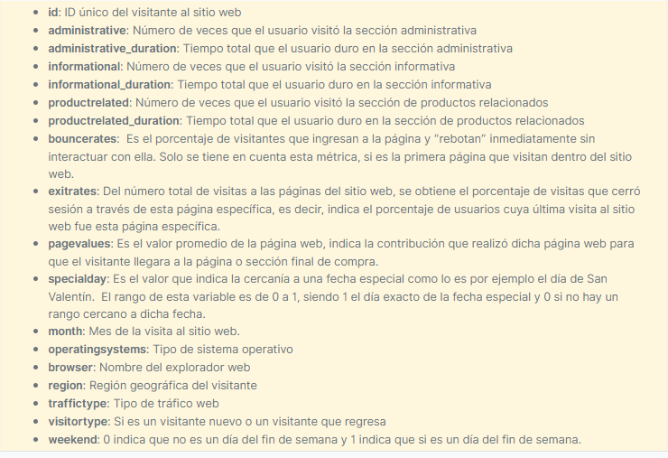

```{r setup, include=FALSE}
knitr::opts_chunk$set(echo = TRUE, warning = FALSE, message = FALSE)
```


# Competencia

- [Link de competencia](https://www.datasource.ai/es/home/data-science-competitions-for-startups/prediccion-de-la-intencion-de-compra-en-una-pagina-web)

<center>

</center>

# Variables

<center>

</center>

# Datos Train

```{r}
library(tidyverse)
library(janitor)
library(lubridate)

data_train <- read_csv("data/train.csv") %>% 
  clean_names() %>% 
  mutate(month = as.factor(month),
         operating_systems = as.factor(operating_systems),
         browser = as.factor(browser),
         region = as.factor(region),
         traffic_type = as.factor(traffic_type),
         visitor_type = as.factor(visitor_type),
         weekend = as.factor(weekend),
         month = fct_relevel(month, "Feb", "Mar", "May", "June", "Jul",
                             "Aug", "Sep", "Oct", "Nov", "Dec"))
data_train %>% head()
```

## Niveles de factores

```{r}
data_train %>% 
  select(is.factor) %>% 
  map(~levels(.x))
```

# Datos Test

```{r}
data_test <- read_csv("data/test.csv") %>% 
  clean_names() %>% 
  mutate(month = as.factor(month),
         operating_systems = as.factor(operating_systems),
         browser = as.factor(browser),
         region = as.factor(region),
         traffic_type = as.factor(traffic_type),
         visitor_type = as.factor(visitor_type),
         weekend = as.factor(weekend),
         month = fct_relevel(month, "Feb", "Mar", "May", "June", "Jul",
                             "Aug", "Sep", "Oct", "Nov", "Dec"))
data_test %>% head()
```

## Niveles de factores

```{r}
data_test %>% 
  select(is.factor) %>% 
  map(~levels(.x))
```

# Descriptivo

## Descriptivo train

```{r}
library(skimr)
skim(data_train)
```

## Descriptivo test

```{r}
skim(data_test)
```

# Exploratorio train

```{r}
library(tidyquant)
library(ggsci)
theme_set(theme_tq())
colores <- scale_color_manual(values = c("#EE0000FF", "#008EA0FF"))
relleno <- scale_fill_manual(values = c("#EE0000FF", "#008EA0FF"))
```

## Distribuciones numéricas

```{r, fig.width=8, fig.height=9}
data_train %>% 
  select(!is.factor, -id) %>% 
  mutate(revenue = as.factor(revenue)) %>% 
  pivot_longer(cols = -revenue) %>% 
  ggplot(aes(x = value, fill = revenue, color = revenue)) +
  facet_wrap(~name, scales = "free", ncol = 3) +
  geom_density(alpha = 0.5) +
  scale_x_log10() +
  colores + 
  relleno +
  theme(legend.position = "top")
```

## Distribución categóricas

```{r, fig.width=8, fig.height=7}
data_train %>% 
  select(is.factor, revenue) %>% 
  mutate(revenue = as.factor(revenue)) %>% 
  pivot_longer(cols = -revenue) %>% 
  ggplot(aes(x = value, fill = revenue, color = revenue)) +
  facet_wrap(~name, scales = "free") +
  geom_bar(position = "fill", alpha = 0.6) +
  colores + 
  relleno +
  theme(axis.text.x = element_text(angle = 45, hjust = 1),
        legend.position = "top")
```


# Feature Engineering

- Obtengo las siguientes nuevas variables:
  - **`semestre`:** Se observan ligeras diferencias entre los meses iniciales (primer semestre) y finales (segundo semestre) del año.
  - **`trimestre`:** trimestres.
  - **`mes_finsem`:** interacción de mes y fin de semana. Uno las dos variables separadas por guión al piso (_.)
  - **`tiempos_total`:** sumo todos los tiempos para cada cliente. Se suman `administrative_duration`, `informational_duration` y `productrelated_duration`.
  - **`visitas_total`:** sumo todas las variables relacionadas con visitas en las secciones de la página web. Se suman `administrative`, `informational` y `productrelated`
  - **`tiempo_promedio`:** divido la nueva variable `tiempos_total` en `visitas_total` para conocer el tiempo promedio que el usuario dura en cada visita a la página web. 
  - **`rate_pagevalues_tiempo`:** divido la variable `page_values` en `tiempos_total`. Supongo que si la contribución de la página web para que el usuario llegara a esa sección de la compra es mayor, también tendra una sumatoria de tiempo mayor, cuyo cociente deberá ser cercano a 1, sin embargo, si la contribución es alta y el tiempo es bajo, el cociente será superior a 1 y sino será inferior a 1.
  - **`inter_pagevalues_tiempo`:** multiplico la variable `page_values` por `tiempos_total`.

## Train
  
```{r}
train_final <- data_train %>% 
  mutate(
    semestre = if_else(
      month %in% c("Feb", "Mar", "May", "June"),
      true = "Semestre1",
      false = "Semestre2"
    ),
    trimestre = if_else(
      month %in% c("Feb", "Mar"),
      true = "Trimestre1",
      false = if_else(
        month %in% c("May", "June"),
        true = "Trimestre2",
        false = if_else(
          month %in% c("Jul", "Aug", "Sep"),
          true = "Trimestre3",
          false = "Trimestre4"
        )
      )
    ),
    mes_finsem = paste0(month, "_" , weekend),
    tiempos_total = administrative_duration + informational_duration
    + product_related_duration,
    visitas_total = administrative + informational + product_related,
    tiempo_promedio = if_else(
      tiempos_total > 0,
      true = tiempos_total / visitas_total,
      false = 0
    ),
    rate_pagevalues_tiempo = if_else(
      page_values > 0,
      true = page_values / tiempos_total,
      false = 0
    ),
    inter_pagevalues_tiempo = page_values * tiempos_total
  ) 

train_final %>% head()
```
  
## Test

```{r}
test_final <- data_test %>% 
  mutate(
    semestre = if_else(
      month %in% c("Feb", "Mar", "May", "June"),
      true = "Semestre1",
      false = "Semestre2"
    ),
    trimestre = if_else(
      month %in% c("Feb", "Mar"),
      true = "Trimestre1",
      false = if_else(
        month %in% c("May", "June"),
        true = "Trimestre2",
        false = if_else(
          month %in% c("Jul", "Aug", "Sep"),
          true = "Trimestre3",
          false = "Trimestre4"
        )
      )
    ),
    mes_finsem = paste0(month, "_" , weekend),
    tiempos_total = administrative_duration + informational_duration
    + product_related_duration,
    visitas_total = administrative + informational + product_related,
    tiempo_promedio = if_else(
      tiempos_total > 0,
      true = tiempos_total / visitas_total,
      false = 0
    ),
    rate_pagevalues_tiempo = if_else(
      page_values > 0,
      true = page_values / tiempos_total,
      false = 0
    ),
    inter_pagevalues_tiempo = page_values * tiempos_total
  ) 

test_final %>% head()
```

# Exploratorio FE

## Distribuciones numéricas

```{r, fig.width=8, fig.height=9}
train_final %>% 
  select(!is.factor, -id) %>% 
  select(!is.character) %>% 
  mutate(revenue = as.factor(revenue)) %>% 
  pivot_longer(cols = -revenue) %>% 
  ggplot(aes(x = value, fill = revenue, color = revenue)) +
  facet_wrap(~name, scales = "free", ncol = 3) +
  geom_density(alpha = 0.5) +
  scale_x_log10() +
  colores + 
  relleno +
  theme(legend.position = "top")
```

## Distribución categóricas

```{r, fig.width=8, fig.height=10}
train_final %>% 
  mutate(across(is.character, as.factor)) %>% 
  select(is.factor, revenue) %>% 
  mutate(revenue = as.factor(revenue)) %>% 
  pivot_longer(cols = -revenue) %>% 
  ggplot(aes(x = value, fill = revenue, color = revenue)) +
  facet_wrap(~name, scales = "free", ncol = 3) +
  geom_bar(position = "fill", alpha = 0.6) +
  colores + 
  relleno +
  theme(axis.text.x = element_text(angle = 45, hjust = 1),
        legend.position = "top")
```

# Exportando train y test

```{r, eval = FALSE}
save(train_final, file = "data/train_final.Rdata", compress = "xz")
save(test_final, file = "data/test_final.Rdata", compress = "xz")
```

