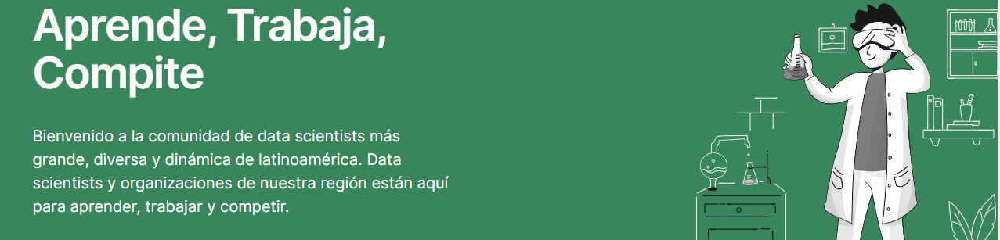

# [DataSource.ai](https://www.datasource.ai/)

- Este repositorio es para desarrollos de Machine Learning en competencias de Data Science en latinoamérica. **Lista de competencias en las cuales participo o participé en algún momento:**
  - [Predicción De La Intención De Compra En Una Página Web (en curso)](https://www.datasource.ai/es/home/data-science-competitions-for-startups/prediccion-de-la-intencion-de-compra-en-una-pagina-web)
  - [Prediciendo El Rating De Las Aplicaciones En Google Play Store (posición 1)](https://www.datasource.ai/es/home/data-science-competitions-for-startups/prediciendo-el-rating-de-las-aplicaciones-en-google-play-store)
  - [Predicción de Retrasos de Vuelos para una Aerolínea (posición 2)](https://www.datasource.ai/es/home/competitions/prediccion-de-retrasos-de-vuelos-para-una-aerolinea)
  - [Inclusión Financiera en Latinoamérica (posición > 20)](https://www.datasource.ai/es/home/competitions/inclusion-financiera-en-latinoamerica)  
  - [Predicción De Precios De Apartamentos En Argentina y Colombia (posición 20)](https://www.datasource.ai/es/home/data-science-competitions-for-startups/prediccion-de-precios-de-apartamentos-en-argentina-y-colombia)

